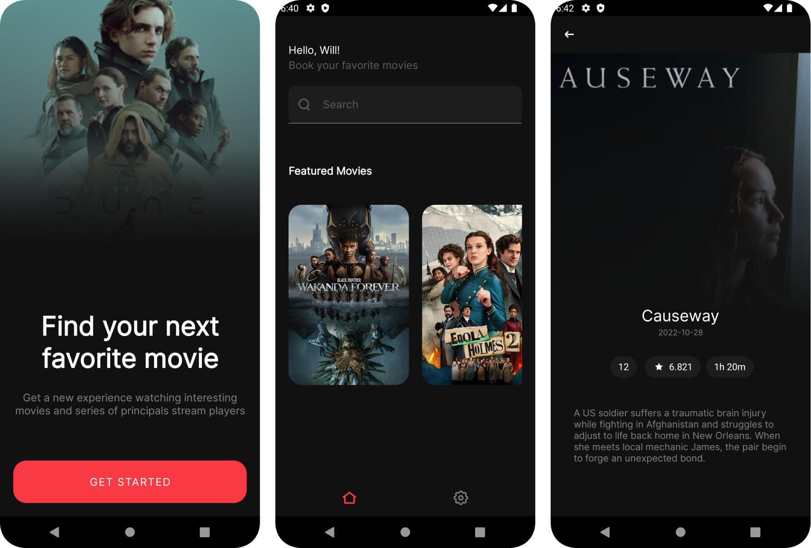

### MovieDB App

A movie application that presents a modern approach to Android development with up to date
tech-stack. In this project you'll find:

- Clean - MVVM Architecture approach
- Github Actions CI
- Repository Pattern
- Android Jetpack Components
- Reactive UI
- Unit Testing
- Usage of [The Movie DB API](https://www.themoviedb.org/)
- [Retrofit](https://square.github.io/retrofit/) - for perform network requests
- [Koin](https://insert-koin.io/) - for dependency injection
- [Mockk](https://mockk.io/) - mocking library
- [Junit](https://junit.org/junit4/) - as a test runner
- [Kotlin Coroutines](https://developer.android.com/kotlin/coroutines) - for managing background
  threads
- [Kotlin Flow](https://kotlinlang.org/docs/flow.html) - for asynchronous operations
- [Glide](https://bumptech.github.io/glide/) - for handle download images from URL
- Clean and minimal design proposal, you can copy this to [your own account here](https://www.figma.com/file/2sb6S625J1m3cNM0YB3hGw/TheMovieDB-App?node-id=0%3A1&t=zMbVMxDI6CKSH21c-1).

## Getting Stated

There are a few ways to open this project.

<strong>Android Studio</strong>

1. Android Studio -> File -> New -> Project from Version Control
2. Enter `https://github.com/WillACosta/MovieDBApp.git` into URL field

<strong>Command line + Android Studio</strong>

1. Run in a terminal:

```shell
  git clone https://github.com/WillACosta/MovieDBApp.git
```

2. Open Android Studio -> File -> Open -> Choose the cloned folder

### Screenshots

<div style="margin: 0 auto">
    
</div>

---
Made with 🖤 by Will
